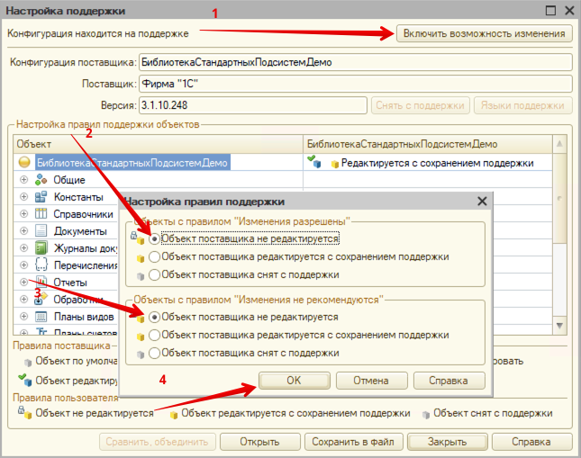
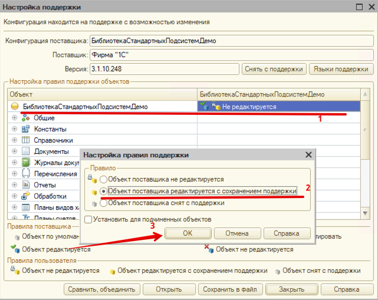

# Установка и настройка

- **Источники поставок**:  
  - `cf`: [Ссылка на актуальную версию](https://example.com/cf-latest.cf)  // todo
  - `cfe`: [Ссылка на расширение](https://example.com/cfe-latest.cfe) //todo
### Поставка cf (через конфигуратор)
- Открыть конфигуратор
- Включите возможность изменения:  
   `Конфигурация → Поддержка → Настройка поддержки → Включить возможность изменения`

- Правой кнопкой мыши по дереву конфигурации

	- Запустить Сравнение/объединение с файлом поставки модуля интеграции
	- Перенести все содержимое поставки
	- Обновить конфигурацию
### Поставка cfe
- Открыть конфигуратор
- `Конфигурация->расширения конфигурации->Добавить`
- В меню расширения: `Конфигурация->загрузить конфигурацию из файла->Обновить`

Далее необходимо сконфигурировать решение согласно требуемой прикладной логике. Продробнее в [Инструкции разработчика](../developer_instruction/2%20demo.md)