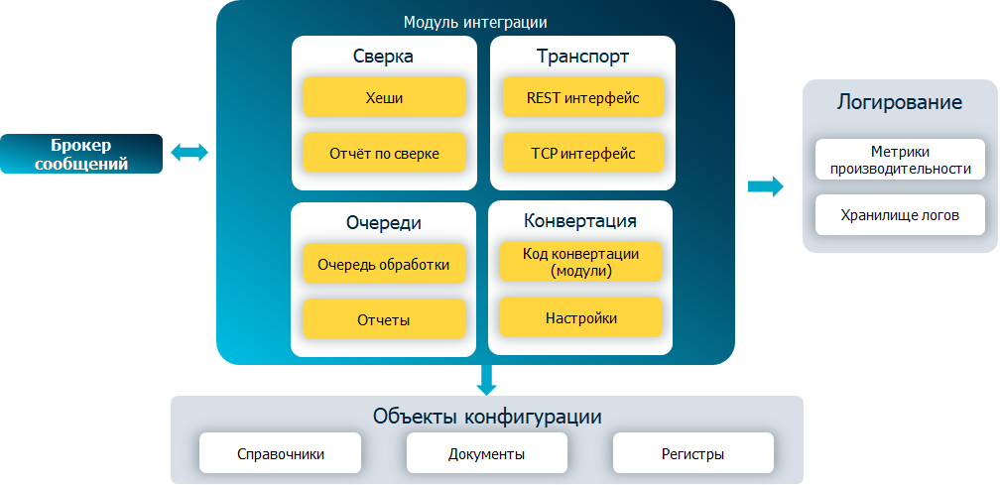
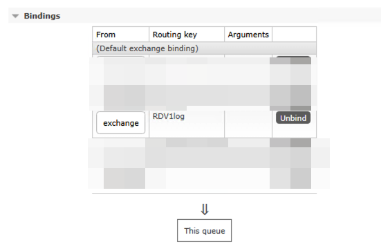
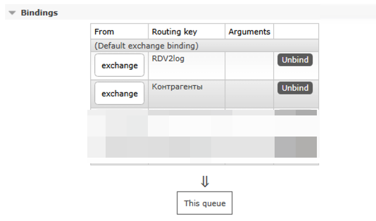

[.png)](https://rdv-it.ru/?utm_source=github&utm_medium=rdv-mi)

# RDV-MI: гибкий инструмент для быстрой разработки и масштабирования механизмов интеграции для платформы 1С: Предприятие

> Расширение на платформе 1С для разработки интеграций с поддержкой RabbitMQ и HTTP-сервисов, встроенными механизмами логирования, конвертации, регистрации и проверки целостности данных

[]()
[]()
[](https://t.me/rdv_mi)

## Оглавление

1. [Кратко](#кратко)
   * 1.1. [Описание](#описание)
   * 1.2. [Когда  использовать](#when_to_use)
2. [Архитектура](#архитектура)
3. [Быстрый старт](#quick_start)
   * 3.1 [Установить модули интеграции в базы Источник, Приемник](#how_to_install)  
   * 3.2 [Скопировать перечисленные модули в базах Источник, Приемник](#copy_integration_modules)
     * 3.2.1. [рдв_МенеджерОбменаДемо](#exchange_demo)
     * 3.2.2. [рдв_РегистрацияИзмененийДемо](#reg_demo)
     * 3.2.3. [рдв_ОбработчикиСобытийДемо](#events_demo)
     * 3.2.4. [рдв_РаботаСОчередямиДемо](#queue_demo)
     * 3.2.5. [рдв_ИнтеграцияДемо](#integration_demo)
     * 3.2.6. [рдв_ФормированиеХешейОбъектовДемо](#hash_demo)
     * 3.2.7. [рдв_МониторингДанныхДемо](#monitor_demo)
   * 3.3 [Настроить RMQ/HTTP](#rmq)
   * 3.4 [Настроить подключение в режиме 1С Предприятие](#connection1С)
   * 3.5 [Настроить Отправку данных из базы Источник](#sending_data)
   * 3.6 [Настроить Получение данных в базе Приемник](#getting_data)
   * 3.7 [Настроить Контроль целостности в базах Источник, Приемник](#check_data)
5. [Лицензия](#license)
6. [Документация](#doc)
7. [Взаимодействие](#help)
8. [Ближайшие планы развития](#backlog)

##  1. <a name='кратко'></a>Кратко
### 1.1. <a name='описание'></a>Описание
**RDV-MI** — это наш вклад в систематизацию и повышение качества разработки интеграционных решений в 1С.
Мы стремимся убрать из процессов случайность и разнообразие подходов, сделать интеграцию управляемой и предсказуемой частью общего жизненного цикла разработки.

**Ключевые возможности:**

**Транспорт**
 - Онлайн обмены через **REST-сервисы** (пир-ту-пир, встроенные в систему)
 - Онлайн обмены через **RabbitMQ** (взаимодействие через брокер и сторонние приложения)

**Обработка данных**
 - Очереди обработки данных для распределения нагрузки (настройка количества попыток, настройка параллельной обработки)
 - Механизмы конвертации данных (предобработка, постобработка, мэппинг)

**Журналирование (логирование)**
 - Журнал сообщений и ошибок обработки
 - Настройка параметров хранения журнала

**Сверка данных**
 - Правила формирования хэша
 - Отчет по сверке полноты и точности данных

**Быстрый запуск**
 - Открытое расширение на языке 1С
 - Документация для разработчиков
 - Встроенные демо примеры

###  1.2. <a name='when_to_use'></a>Когда  использовать

**Разветленная схема потоков данных между системами (микросервисы):**
 - много источников - много потребителей
 - несколько потребителей для одного источника
   > брокер упрощает схему интеграционных процессов наличием центра маршрутизации

**Используется большое количество маленьких/легковесных сообщений:**
 - сообщения уведомлений пользователей
 - использование сильно граннулированных сообщений обмена данными для передачи - например, передача остатков по товарам
    > брокер может не хранить данные на диске, используя только ресурс сети и ОЗУ для передачи данных

**Высокие требования к оперативности доставки данных (мгновенные сообщения):**
 - передача изменений остатков товаров
    > брокер держит постоянное tcp соединение с потребителем, что позволяет позволяет доставлять данные практически online

##  2. <a name='архитектура'></a>Архитектура



##  3. <a name='quick_start'></a>Быстрый старт

###  3.1 <a name='how_to_install'></a>Установить модули интеграции в базы Источник, Приемник

[Инструкция по установке модуля](./doc/admin/how_to_install_mi.md)


###  3.2 <a name='copy_integration_modules'></a>Скопировать перечисленные модули в базах Источник, Приемник

Для описания структуры своих интегрируемых данных необходимо, как в базе Источник, так и в базе Приемник, создать  модули копированием ниже перечисленных модулей.

Новые имена предлагаем сформировать по принципу "рдв_ПрефиксОрганизации_ИмяМодуля".

Далее необходимо скорректировать указанные методы под структуру своих баз данных. 

Для каждого метода есть пояснения, используется он в Источнике или Приемнике:

####  3.2.1. <a name='exchange_demo'></a>рдв_МенеджерОбменаДемо

Назначение: описание правил конвертации объектов

Подключение: указать созданный модуль в `рдв_ИнтеграцияПереопределяемый.МодульПрикладнойЛогикиМенеджераОбмена`

```java
// Описание правил конвертации объектов
Процедура ЗаполнитьПравилаКонвертацииОбъектов(СвойстваКонвертации, НаправлениеОбмена) Экспорт

	// Для источника
	Если НаправлениеОбмена = "Отправка" Тогда
	
		ДобавитьПКО_Справочник_Контрагенты(СвойстваКонвертации);

	// Для приемника
	ИначеЕсли НаправлениеОбмена = "Получение" Тогда
		
		ДобавитьПКО_Справочник_Контрагенты(СвойстваКонвертации);
		
	КонецЕсли;
	
КонецПроцедуры

// Имя текущей ИБ, уникально на все узлы обмена
// Идентифицирует источник входящего сообщения (например, Имя текущей базы) 
Функция ИмяИБ() Экспорт

	Возврат "RDV1";// Например, RDV1 - Источник."RDV2" - Приемник 
	
КонецФункции

// Выгружаемый реквизитный состав, с учетом правил и полей поиска
// Как для источника так и для приемника.
Процедура ДобавитьПКО_Справочник_Контрагенты(СвойстваКонвертации)

	ПКО = рдв_МенеджерОбмена.ДобавитьПКО(СвойстваКонвертации, Метаданные.Справочники._ДемоКонтрагенты);
	ПКО.ИмяОбъекта = "Справочник.Контрагенты";
	ПКО.ИмяПКО = "Справочник_Контрагенты";
	
	КонвертацияШапки = ПКО.КонвертацияШапки;
	ИмяРеквизита = "ИНН";    // Имя реквизита текущей конфигурации
	ИмяКлючаФормата = "ИНН"; // Представление реквизита в формате обмена (Для Источника - имя, с которым будет выгружено, для Приемника - имя загружаемых данных)
	Обязательный = Истина;
	рдв_МенеджерОбмена.ДобавитьПКС(КонвертацияШапки, ИмяРеквизита, ИмяКлючаФормата, Обязательный);
	... // прочие реквизиты
	
	ИмяТаблЧасти = "КонтактнаяИнформация";    // Имя табличной части текущей конфигурации 
	ИмяКлючаФормата = "КонтактнаяИнформация"; // Представлениетреквизита в формате обмена
	ТаблЧасть = рдв_МенеджерОбмена.ДобавитьТаблЧасть(СвойстваКонвертации, ПКО, ИмяТаблЧасти, ИмяКлючаФормата);
	// реквизиты табличной части
	рдв_МенеджерОбмена.ДобавитьПКС(ТаблЧасть, "Представление", "Представление");
	рдв_МенеджерОбмена.ДобавитьПКС(ТаблЧасть, "Тип", "Тип");
	... // прочие реквизиты
	
	ПоляПоиска = ПКО.ПоляПоиска;
	рдв_МенеджерОбмена.ДобавитьПоляПоиска(ПоляПоиска, "Код");
	
КонецПроцедуры

```

####  3.2.2. <a name='reg_demo'></a>рдв_РегистрацияИзмененийДемо

Назначение: описание правил регистрации/маршрутизации объектов

Подключение: указать созданный модуль в `рдв_ИнтеграцияПереопределяемый.МодульПрикладнойЛогикиРегистрацииИзменений`

```java
// Правила регистрации объектов для выгрузки во внешние системы.
// Только для источника, приемник не регистрирует объекты к отправке.
Процедура ЗаполнитьПравилаРегистрации(ПравилаРегистрации) Экспорт
		
	RMQ = Справочники.рдв_ВнешниеСистемы.Предопределенный("RMQ");
	
	Процедура ДобавитьПравилоРегистрации(ПравилаРегистрации,
										МетаданныеОбъекта,
										ВнешняяСистема,
										АдресМетода = "")
											
	ПравилоРегистрации = ПравилаРегистрации.Добавить();
	ПравилоРегистрации.МетаданныеОбъекта = Метаданные.Справочники._ДемоКонтрагенты;
	ПравилоРегистрации.ВнешняяСистема = RMQ;
	ПравилоРегистрации.АдресМетода = "exchange";
								
КонецПроцедуры

// Ключ маршрутизации для брокеров
// Для источника
Функция МаршрутСообщения(ИсточникСообщения, ВнешняяСистема) Экспорт
	
	Если ИсточникСообщения.Метаданные() = Метаданные.Справочники._ДемоКонтрагенты Тогда
		Возврат "Контрагенты";
	Иначе
		Возврат ИсточникСообщения.Метаданные().Имя;
	КонецЕсли;
	
КонецФункции

```

####  3.2.3. <a name='events_demo'></a>рдв_ОбработчикиСобытийДемо

Назначение: определяет способ регистрации объектов (механизм через очереди или непосредственно)

Подключение: указать созданный модуль в `рдв_ИнтеграцияПереопределяемый.МодульПрикладнойЛогикиОбработчиковСобытий`

```java
// Обработчик подписки на событие при записи справочников
// регистрирует объекты на выгрузку непосредственно в механизм регистрации
// Только для источника.
Процедура СправочникиПриЗаписи(Источник, Отказ) Экспорт
	
	Если Не ТипЗнч(Источник) = Тип("СправочникОбъект._ДемоКонтрагенты") Тогда
		Возврат;
	КонецЕсли;
	
	рдв_РегистрацияИзменений.ЗарегистрироватьИзменения(Источник);
	
КонецПроцедуры

Процедура ДокументыПриЗаписи(Источник, Отказ) Экспорт
КонецПроцедуры

Процедура НаборыЗаписейПриЗаписи(Источник, Отказ, Замещение) Экспорт
КонецПроцедуры
```

####  3.2.4. <a name='queue_demo'></a>рдв_РаботаСОчередямиДемо

Назначение: обработка очередей интеграции. Механизм отложенной обработки данных интеграции.

Подключение: указать созданный модуль в `рдв_ИнтеграцияПереопределяемый.МодульПрикладнойЛогикиОчередей`

```java
// Регистрируем очередь для обработки входящих сообщений
// Для источника и приемника
Процедура ЗаполнитьСписокОчередей(СписокОчередей) Экспорт
	
	СписокОчередей.Добавить("ОбработкаВходящихСообщений", 
		НСтр("ru = 'Обработка входящих сообщений'"));
		
КонецПроцедуры

// Настраиваем очередь
// Для источника и приемника
Процедура ЗаполнитьТипОчередиПоУмолчанию(ИмяОчереди, ТипОчередиОбъект) Экспорт
	
	Если ИмяОчереди = "ОбработкаВходящихСообщений" Тогда
		
		ТипОчередиОбъект.ПорционнаяОбработка = Истина;
		ТипОчередиОбъект.МаксЗаписейВПорции = 4;
		
	КонецЕсли;
	
КонецПроцедуры

// Обрабатываем данные очереди
// Для источника и приемника
Процедура ВыполнитьОбработкуОчереди(ИмяОчереди, ИдентификаторыОчереди, РезультатОбработки) Экспорт
	
	Если ИмяОчереди = "ОбработкаВходящихСообщений" Тогда
		// Запрос данных очереди
		ДанныеОчереди = рдв_РаботаСОчередями.ПолучитьДанныеОчереди(ИмяОчереди,
			ИдентификаторыОчереди, "ИдентификаторЗаписи,ХранилищеПараметров");
			
		Если Не ЗначениеЗаполнено(ДанныеОчереди) Тогда
			Возврат;	
		КонецЕсли;
		
		Для Каждого ЗаписьОчереди Из ДанныеОчереди Цикл
	
			Идентификатор = ЗаписьОчереди.ХранилищеПараметров.Получить();
			рдв_Интеграция.СообщениеОбработатьПолученное(Идентификатор.ИдентификаторСообщения);
			
			ИдентификаторыСообщений.Добавить(Идентификатор);
			
		КонецЦикла;
	
	КонецЕсли;
	
КонецПроцедуры

#КонецОбласти

```

####  3.2.5. <a name='integration_demo'></a>рдв_ИнтеграцияДемо

Назначение: предоставляет возможность реализовать новый тип внешней системы (kafka, ftp, прочие)

Подключение: указать созданный модуль в `рдв_ИнтеграцияПереопределяемый.МодульПрикладнойЛогикиИнтеграции`

Реализовать программное API, прикладную логику методов можно не заполнять.

####  3.2.6. <a name='hash_demo'></a>рдв_ФормированиеХешейОбъектовДемо

Назначение: правила расчета хешей объектов для целей сверки полноты и точности данных

Подключение: указать созданный модуль в `рдв_ИнтеграцияПереопределяемый.МодульПрикладнойЛогикиФормированияХешей`

Реализовать программное API, прикладную логику методов можно не заполнять.

####  3.2.7. <a name='monitor_demo'></a>рдв_МониторингДанныхДемо

Назначение: определяет внешнюю систему мониторинга

Подключение: указать созданный модуль в `рдв_ИнтеграцияПереопределяемый.МодульПрикладнойЛогикиМониторингаДанных`

Реализовать программное API, прикладную логику методов можно не заполнять.


###  3.3 <a name='rmq'></a>Настроить RMQ/HTTP

Настроить в качестве транспорта обмена один из предустановленных вариантов:

#### 3.3.1 Настроить сервер RMQ согласно [инструкции](./doc/admin/how_to_RMQ.md):

 * Создать вирутальный хост
 * Создать обменник exchange
 * Создать 2 очереди Queue (данное имя будет указываться в справочнике Внешние системы в поле "Очередь обмена") для баз Источник и Приемник
 * Создать маршруты сообщений Binding:
    * Для очередей Queue Источника и Приемника создать запись для логирования по шаблону [ИмяБазы]log (Имя базы прописывается в указанной выше функции ИмяИБ(), см п.3.2.1)
    * Для очереди Приемника создать записи с именами маршрутов сообщения, которые прописываются в Функции МаршрутСообщения в базе Источник и предназначены для загрузки в данную базу Приемник
    * Если включен контроль целостности (Константы.рдв_ФормироватьХешОбъектов), то необходимо для обеих очередей Queue создать записи по шаблону "[ИмяМаршрутаСообщения].Хеш" (Например, "Контрагенты.Хеш")
 
Для источника: значение из `рдв_МенеджерОбменаДемо.ИмяИБ`



Для приемника: ключ маршрутизации из `рдв_РегистрацияИзмененийДемо.МаршрутСообщения` и значение из `рдв_МенеджерОбменаДемо.ИмяИБ`



#### 3.3.2 Опубликовать HTTP-сервис согласно [инструкции](./doc/admin/how_to_HTTP.md):

###  3.4 <a name='connection1С'></a>Настроить подключение в режиме 1С Предприятие

Настройка подключений в 1С:

Все необходимые для работы объекты в 1С располагаются в разделе "Интеграция (РДВ)":

   * Выполнить настройку подключений Справочника "ВнешниеСистемы"
   
     [Инструкция по настройкам в режиме предприятия](./doc/admin/how_to_1c.md)
   
     Пример для заполнения RMQ, адрес сервера RMQ https://mq.it.ru:14274/# :
     
     Имя сервера: mq.it.ru
     
     Порт: 4274
     
     Защищенное соединение: Истина
     
     Очередь обмена: имя очереди Queue (см. п. 3.3.1)
     
     Хост: Виртуальный хост (см. п. 3.3.1)
   
   
   * Инициализировать типы очередей:
   
      Выполнить обработку:
      Раздел Интеграция (РДВ)\ Типы очередей обработки данных \ Еще \ Инициализировать типы очередей

###  3.5 <a name='sending_data'></a>Настроить Отправку данных из базы Источник

Автоматическая отправка данных настраивается в справочнике Внешние системы на вкладке "Расписание"
 
Необходимо установить галку "Использовать расписание", настроить расписание для отправки данных.

В ручном режиме для отправки данных необходимо:
 * Записать объект
 * В регистре "Регистрация изменений" выбрать нужную позицию и нажать "Сформировать сообщения"
 * В регистре "Сообщения интеграции" выбрать нужную позицию и нажать "Обработать сообщение"

###  3.6 <a name='getting_data'></a>Настроить Получение данных в базе Приемник

Автоматическое получение данных настраивается в справочнике Внешние системы на вкладке "Расписание"
 
Необходимо установить галку "Использовать расписание", настроить расписание для получения данных.

Далее необходимо настроить расписание для Обработки входящих сообщений:
в справочнике "Типы очередей обработки данных" для типа очереди "Обработка входящих сообщений" необходимо настроить расписание на вкладке "Регламент".

В ручном режиме для получения данных необходимо:
 * Получить данные через запуск регламентного задания Интеграции: "RMQ Получение"
 * После выполнения данного регл.задания сформируются очереди в РегистрСведений.рдв_ОчередиОбработкиДанных.
 * Открыть данный регистр очередей можно в разделе Интеграция (РДВ) \ Очереди обработки данных. Далее необходимо встать на нужную очередь и запустить обработку очереди по кнопке "Действия\Обработать очереди"

###  3.7 <a name='check_data'></a>Настроить Контроль целостности

[Инструкция по конфигурированию контроля целостности данных](./doc/developer/4%20check%20that%20data%20fine.md)

# 4. <a name='full_dev_instruction'></a>Подробная инструкция разработчика

[Документация по администрированию и разработке](./doc/README.md)


# 5. <a name='license'></a>Лицензия

[Лицензия BSD-3-Clause license](./LICENSE.txt)

# 6. <a name='doc'></a>Документация

[Документация](./doc/README.md)
Ссылки на инструкции и другую документацию на странице

# 7. <a name='help'></a>Взаимодействие

Получить или предложить помощь можно в [чате Telegram](https://t.me/rdv_mi)

# 8. <a name='backlog'></a>Ближайшие планы развития

**Внешний мониторинг стабильности и производительности**
 - Grafana
 - Prometheus

**Внешнее журналирование**
 - Click House

**Помощник для специалистов поддержки: анализ и обработка коллизий**
 - Связи журнала и запросов интеграций с обьектами и ошибками
 - Отчет по мониторингу очередей
 - Отчет по мониторингу ошибок интеграций
 - Версионирование правил: журнал изменений

**Оповещения**
 - E-mail
 - Telegramm
 - Mattermost
 - SMS
 - MAX

**Брокер сообщений**
 - Kafka
 - Поддержка WebSocket

**Low-code помощник формирования кода без интерактивной настройки**
