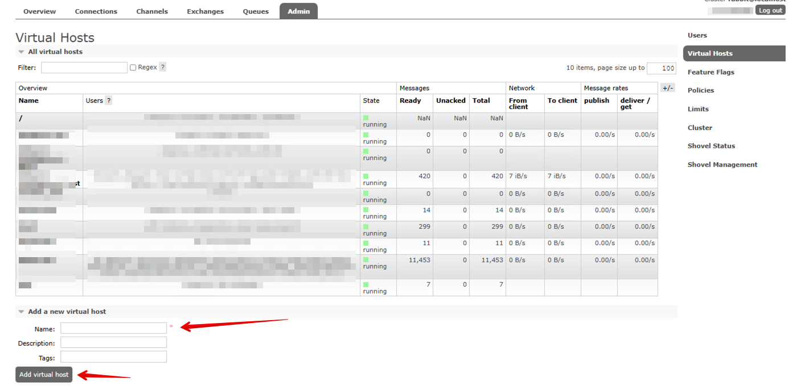
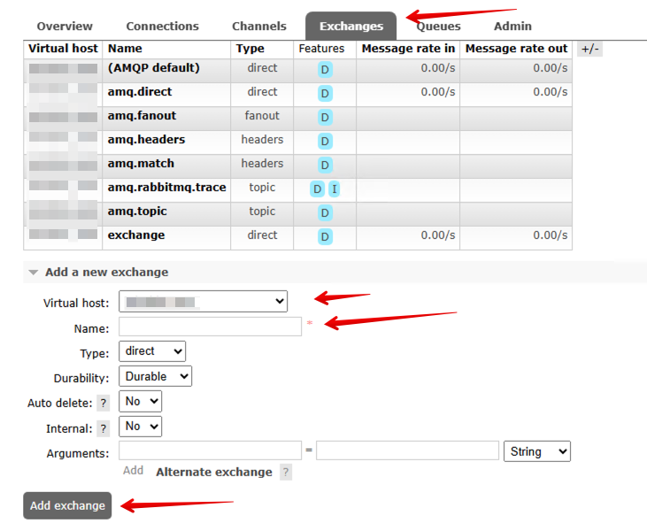
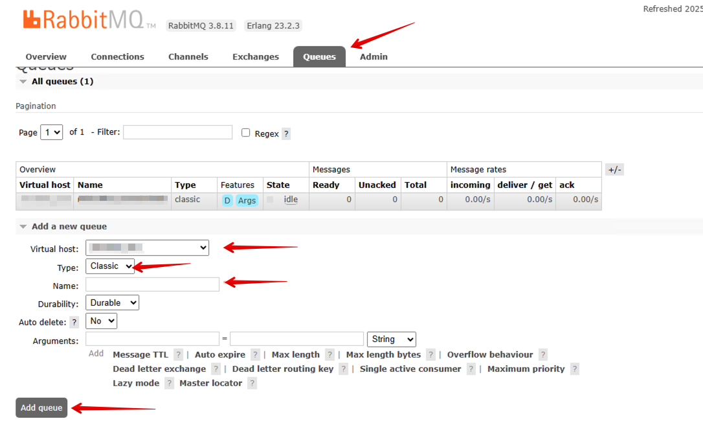

**Необходимо развернуть сервер и установить на него RabbitMQ.**  
[Официальная инструкция](https://www.rabbitmq.com/docs) по установке и началу работы.
### 1. Создание Virtual Host (Виртуального хоста)

Virtual Host (VHost) — это изолированное пространство для разделения ресурсов (очередей, обменников, пользователей).

- **Не рекомендуется использовать дефолтный `/`**, так как это ведет к:
    - Риску конфликтов имен между разными сервисами.
    - Отсутствию изоляции (например, между dev, test и prod окружениями).
- **Рекомендация:** Создайте отдельный VHost для вашего модуля интеграции.
    - **Имя VHost:** `/1c_integration` (или осмысленное название вашего проекта)

**Действие:** В панели управления RabbitMQ перейдите во вкладку `Admin -> Virtual Hosts`, заполните поле `Name` и нажмите `Add Virtual Host`.  

### 2. Создание Exchange (Обменника)

Exchange отвечает за маршрутизацию сообщений в очереди. Он получает сообщения от отправителей (продюсеров) и, основываясь на правилах, решает, в какую очередь их направить.

**Действие:** Перейдите во вкладку `Exchanges` -> `Add a new exchange`.
**Заполните поля:**
- **Virtual Host:** Выберите созданный на предыдущем шаге VHost (напр. `/1c_integration`).
- **Name:** Уникальное имя обменника. Рекомендуется использовать осмысленные названия, например, `1c_data_exchange`.
- **Type:** Выберите тип обменника. Для интеграции с 1C, где нужна гибкая маршрутизация по типам событий, чаще всего используется **`topic`**.
- **Durability:** `Durable` (гарантирует, что обменник сохранится после перезагрузки сервера).
- **Остальные параметры** (Auto delete, Internal) можно оставить по умолчанию.
    
Нажмите `Add exchange`.

### 3. Создание Queue (Очереди)

Queue — это почтовый ящик, где сообщения хранятся до момента обработки получателем (консьюмером).

**Действие:** Перейдите во вкладку `Queues` -> `Add a new queue`.
**Заполните поля:**
- **Virtual Host:** Выберите ваш VHost (напр. `/1c_integration`).
- **Name:** Уникальное имя очереди. Консьюмеры 1C будут подписываться на сообщения именно по этому имени. Например, `ib1_logs`.
- **Type:** `Classic` (обычно достаточно для задач интеграции).
- **Durability:** `Durable` (очередь переживет перезагрузку сервера).
- **Остальные параметры** (Auto delete, Exclusive) оставьте выключенными для надежной работы.

Нажмите `Add queue`.

Необходимо создать несколько очередей:
- для каждой из баз приемника (consumer). Из этих очередей приемники будут читать свои сообщения
- одну очередь для базы источника. В эту очередь будут попадать ответы от подписчиков со служебным данными.
### 4. Привязка Exchange и Queue (Создание Binding)

Без этой привязки Exchange и Queue существуют независимо. Сообщения, приходящие на Exchange, будут потеряны, так как некуда их направить. Привязка создает правило для маршрутизации.

**Действие:**
Приемники - в эти очереди будут попадать все сообщения источника
1. Перейдите в только что созданные очереди приемников, кликнув на имя очереди в списке.
2. Найдите секцию `Bindings` и подсекцию `Add binding from this queue`.
3. Заполните поля для создания новой привязки:
    - **From exchange:** Выберите имя созданного вами обменника (напр. `1c_data_exchange`).
    - **Routing key:** Укажите ключ маршрутизации - типы сообщений которые должен будет получать этот подписчик (например, Контрагенты, КурсыВалют) **Это критически важное поле, которое должно совпадать с тем, что указывается в коде модуля интеграции 1C.**
4. Нажмите `Bind`.

Источники - эта связка нужна для получения служебных сообщений от приемника.
1. Перейдите в созданную очередь источника, кликнув на имя очереди в списке.
2. Найдите секцию `Bindings` и подсекцию `Add binding from this queue`.
3. Заполните поля для создания новой привязки:
    - **From exchange:** Выберите имя созданного вами обменника (напр. `1c_data_exchange`).
    - **Routing key:** 
	   - **Шаблон:** `{ИмяИнформационнойБазы}log` (например, `ib1log`, `accounting_devlog`).
        - _Пояснение:_ В методе `ИмяИБ()` модуля интеграции 1C формируется имя базы. К нему добавляется постфикс (`log`), и это полное значение используется как `routing_key` при публикации сообщения в RabbitMQ (например, `RDV1log`).

**Важно:** Необходимо создать отдельную привязку для каждой информационной базы (ИБ) (из метода ИмяИБ() модуля интеграции), участвующей в интеграции. Например, для двух баз `trade` и `accounting` нужно создать две привязки с Routing key `tradelog` и `accountinglog` соответственно, ведущие в одну или разные очереди (в зависимости от логики).  
